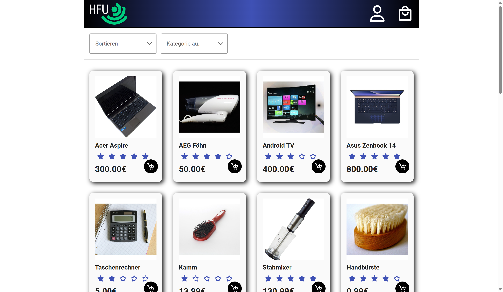

# Shop-App

## WPV Web-Programmierung React (Noll) WiSe24-25

##### Autor: Niklas Riedinger

### Infos

[Felixkurs](https://felix.hs-furtwangen.de/auth/RepositoryEntry/49021170/CourseNode/110513453899497)

[Projektanforderungen](./attachments/Projekt_Shop_App_Beschreibung.pdf)

### Verwendete Technologien

- [react](https://www.npmjs.com/package/react)
- [typescript](https://www.npmjs.com/package/typescript)
- [sass](https://www.npmjs.com/package/sass)
- [react-redux](https://www.npmjs.com/package/react-redux)
- [axios](https://www.npmjs.com/package/axios)
- [js-cookie](https://www.npmjs.com/package/js-cookie)
- [primereact](https://www.npmjs.com/package/primereact)
- [react-icons](https://www.npmjs.com/package/react-icons)

### Preview

